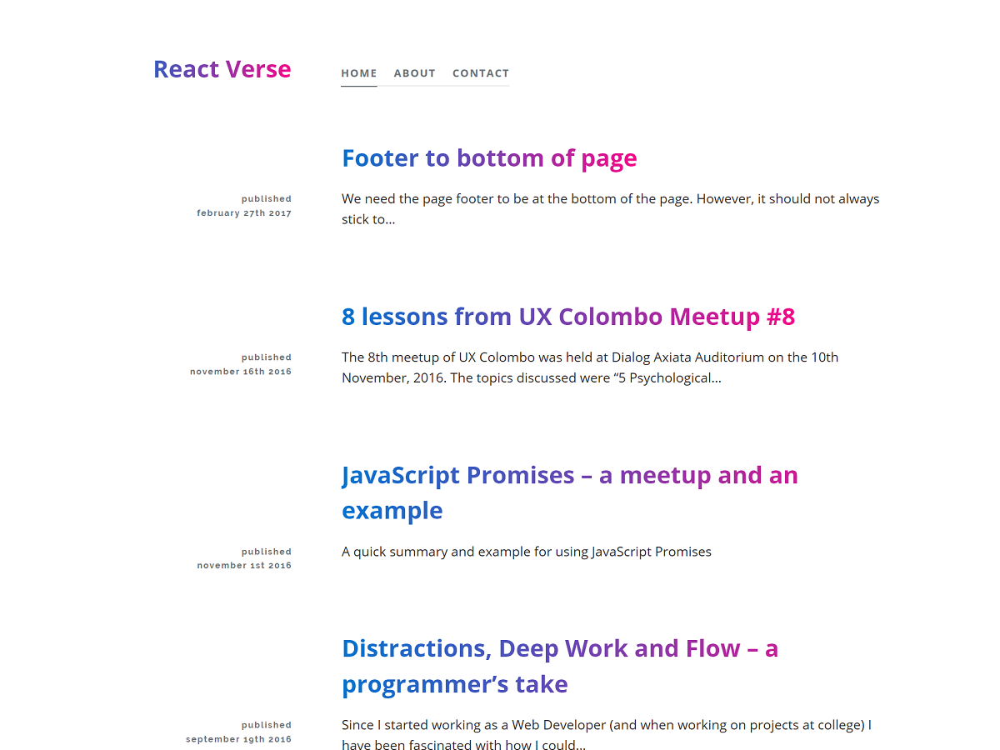

React Verse
========

A modern react-based theme for WordPress, using Webpack 2 for bundling.

Setup
-----

Since this is a more "experimental" theme, you'll need to have a few things set up before it'll work.

1. WordPress 4.7 or higher, which includes the REST API content endpoints.
2. You'll also need this [WP-API Menus plugin](https://wordpress.org/plugins/wp-api-menus/). The REST API doesn't provide an endpoint for menus, so another plugin is necessary.
3. Your permalinks will need to be set to `/%year%/%monthnum%/%postname%/`. Single-post/page views will not work without permalinks set. Category & tag archives bases should be set to `category` and `tag`, respectively.

About
------------------

This theme is built based on [Foxhound](https://wordpress.org/themes/foxhound/), the first REST API powered theme on WordPress.org.

Thanks to…
----------

These are a few of the themes/plugins/packages that made this theme possible.

- [Foxhound](https://github.com/ryelle/Foxhound)
- [WP-API](http://v2.wp-api.org/)
- [WP API Menus Plugin](https://wordpress.org/plugins/wp-api-menus/)
- [node-wpapi](https://www.npmjs.com/package/wpapi)
- [wordpress-rest-api-oauth-1](https://www.npmjs.com/package/wordpress-rest-api-oauth-1)
- [react-document-meta](https://www.npmjs.com/package/react-document-meta)
- [react-router-scroll](https://www.npmjs.com/package/react-router-scroll)

Development
-----------

You can also install React Verse yourself from this repo, by building it yourself. Download or clone this repo into your `/themes` folder, then run npm to install and build the javascript & CSS files. The process will look like this

	git clone https://github.com/m-muhsin/react-verse react-verse
	cd react-verse
	npm install
	npm run build

Now you'll see a `build/app.js` file in the theme, and it will be available for you to switch to in wp-admin. 

_If you don't have npm installed, you can find instructions on [the npm website](http://npmjs.com)._

There are a few other NPM scripts you can run:

`npm run dev` runs `webpack`, with configuration enabling source maps. Eventually `build` will also compress/uglify built files, so this would skip that too (but that's currently disabled).

`npm run watch` runs `webpack --watch`, everything the previous command but it will also watch the source files for changes and recompile automatically. Best to run while developing. This *does not* live reload.

`npm run lint` runs `eslint` over all the javascript files. Webpack does this as well, before compiling, but only notifies you of errors. This command will catch warnings too.

On the PHP side, we're also adding in some prefixes for permalinks (also called routes).

Thanks for checking out React Verse!
